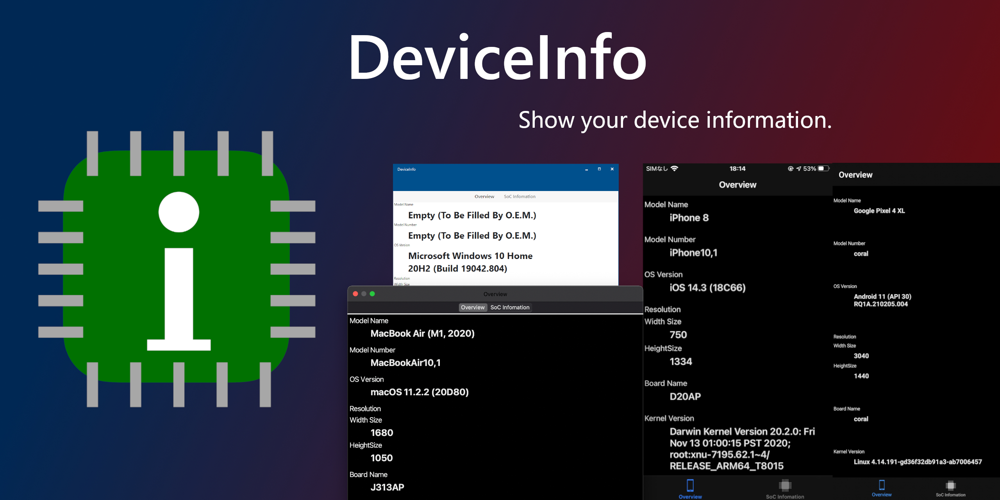

# Welcome to DeviceInfo!

DeviceInfoは、デバイスの情報を表示できる、Xamarin.Forms ベースの、クロスプラットフォームアプリです。

端末のモデルの名前からチップの情報まで、様々な情報を入手することができます。

バージョン1.0で大幅にコードが改良され、オープンソースになりました。

# Download

**[ダウンロードは、リリースページを参照してください。](https://github.com/CoreNion/DeviceInfo/releases)**

# LICENSE

[Apache License 2.0](./LICENSE)

# Credit

- [Get-iOS-Model - Displaying device names on iOS and sysctl techniques on iOS and macOS](https://github.com/dannycabrera/Get-iOS-Model)

- [Costura.Fody - Create an exe on wpf that works only with executable files.](https://github.com/Fody/Costura)